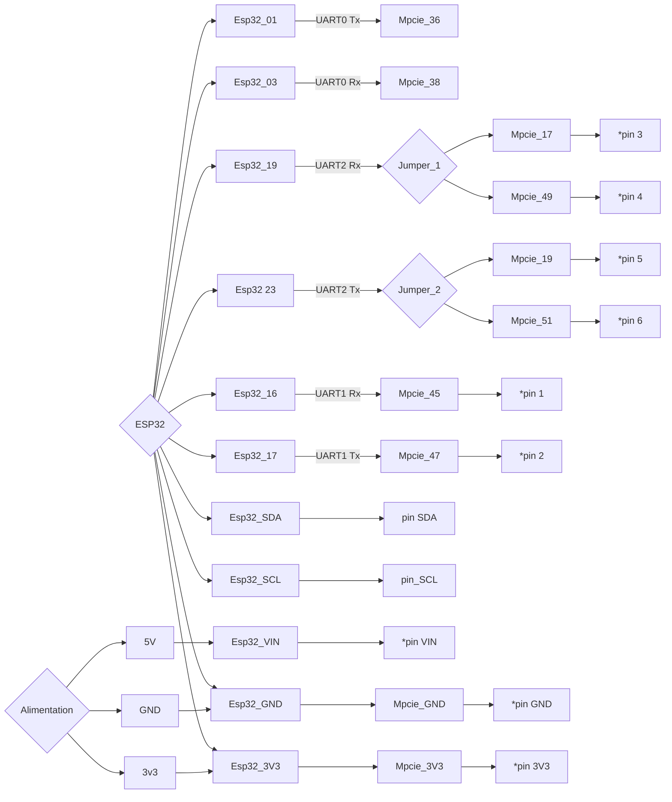

# Cahier des charges - Développement et Fabrication Projet Rover GNSS

## Modules GNSS Possibles

1. **F9P Drotek Mpcie:**
   - [Lien Produit](https://store-drotek.com/923-DP0602.html)
   - [Fiche Technique](https://raw.githubusercontent.com/drotek/datasheets/master/DrotekDoc_0923%20-%20DP0602%20(mPCIe%20F9P).pdf)
   - 

2. **F9P Ardusimple Mpcie:**
   - [Lien Produit](https://www.ardusimple.com/product/simplertk2b-mpcie-zed-f9p/)
   - Connectique en évolution pour les prochains modèles, en attendant : [Guide d'intégration PCB](https://www-ardusimple-com.translate.goog/pcb-integration-guide-simplertk2b-mpcie/?_x_tr_sl=auto&_x_tr_tl=en&_x_tr_hl=auto)

3. **Mosaic X5 Ardusimple Mpcie:**
   - [Lien Produit](https://www.ardusimple.com/product/simplertk3b-mpcie-septentrio-mosaic/)
   - 

## Référence des Pinouts des Cartes GNSS en Mpcie

1. **F9P Mpcie Ardusimple:**
   - 36 USB_DATA-
   - 38 USB_DATA+
   - 22 RESET

2. **F9P Mpcie Drotek:**
   - 17 UART1 Tx
   - 19 UART1 Rx
   - 36 USB_DATA-
   - 38 USB_DATA+
   - 45 UART2 Tx
   - 47 UART2 Rx
   - 49 EXTINT
   - 51 TIMEPULSE

3. **Mosaic X5 Mpcie Ardusimple:**
   - 11 COM2 Rx
   - 13 COM2 Tx
   - 17 EXTINT
   - 19 TIMEPLUSE
   - 22 RESET
   - 36 USB_DATA-
   - 38 USB_DATA+
   - 45 COM3 Rx
   - 47 COM3 Tx
   - 49 COM1 Rx
   - 51 COM1 Tx

## Microcontrôleur ESP32 WROOM

- [Pinout Joy-It SBC-NodeMCU-ESP32](https://joy-it.net/files/files/Produkte/SBC-NodeMCU-ESP32/SBC-NodeMCU-ESP32-Manual-2021-06-29.pdf)

  

## Connexion ESP32 -> F9P Drotek

### Dev Actuel Transposé au Matériel Connectique Mpcie

> L'ensemble des projets est théoriquement adaptable en connexion sur les pinouts USB, mais l'accès aux autres pins est essentiel au maximum.

- **Projet "ROVER Bluetooth"** ([Lien GitHub](https://github.com/jancelin/RoverGNSS_RTK_BT_esp32_f9p))
  - 16 UART1 Rx ESP32 -> UART1 17 Tx Drotek F9P
  - 17 UART1 Tx ESP32 -> UART1 19 Rx Drotek F9P

- **Projet "PHYSALIA_MAVI"** ([Lien GitHub](https://github.com/jancelin/physalia/tree/main/buoy_mavi))
  - Connexion data en SDA/SDC, possible de l'adapter en UART (normalement):
  - 16 UART1 Rx ESP32 -> UART1 17 Tx Drotek F9P
  - 17 UART1 Tx ESP32 -> UART1 19 Rx Drotek F9P

- **F9p-ntrip-esp32** ([Lien GitHub](https://github.com/buched/F9p-ntrip-esp32))
  - 17 UART1 Rx ESP32 -> UART1 17 Tx Drotek F9P
  - 23 VSPI_MOSI ESP32 -> UART1 19 Rx Drotek F9P

...

## Possibilités

### Objectif PCB

Offrir le plus de possibilités de connexion entre l'ESP32, le récepteur GNSS, et des pins à souder. Si il n'est pas possible d'avoir une connexion directe, prévoir des pins à souder qui amènent directement au port du matériel.

### Pins Communs aux Récepteurs GNSS Mpcie

- **Pin 36**
  - USB_DATA- (Sortie - Drotek)
  - USB_DATA- (Sortie - Ardusimple MosaicX5)

- **Pin 38**
  - USB_DATA+ (Sortie - Drotek)
  - USB_DATA+ (Sortie - Ardusimple MosaicX5)

- **Pin 17**
  - Extint (Entrée et Sortie)
  - UART1 Tx (Sortie - Drotek)

- **Pin 19**
  - Timepulse (Entrée et Sortie)
  - UART1 Rx (Entrée - Drotek)
  - Timepulse (Sortie - Ardusimple MosaicX5)

- **Pin 45**
  - UART2 Tx (Sortie - Drotek)
  - COM3 Rx (Entrée - Ardusimple MosaicX5)

- **Pin 47**
  - UART2 Rx (Entrée - Drotek)
  - COM3 Tx (Sortie - Ardusimple MosaicX5)

- **Pin 49**
  - Extint (Sortie - Drotek)
  - COM1 Rx (Entrée - Ardusimple MosaicX5)

- **Pin 51**
  - Timepulse (Sortie - Drotek)
  - COM1 Tx (Sortie - Ardusimple MosaicX5)

### Connexion ESP32 -> GNSS

- **Pin 01 UART0 Tx** -> **Pin 36**
  - USB_DATA- (Entrée - Drotek)
  - USB_DATA- (Entrée - Ardusimple MosaicX5)

- **Pin 03 UART0 Rx** -> **Pin 38**
  - USB_DATA+ (Sortie - Drotek)
  - USB_DATA+ (Sortie - Ardusimple MosaicX5)

- **Pin 16 UART1 Tx** -> **Pin 45**
  - UART2 Tx (Sortie - Drotek)
  - COM3 Rx (Entrée - Ardusimple MosaicX5)

- **Pin 17 UART1 Rx** -> **Pin 47**
  - UART2 Rx (Entrée - Drotek)
  - COM3 Tx (Sortie - Ardusimple MosaicX5)
 
- **Pin 22 VSPI_MOSI Rx** -> 

### Objectifs Supplémentaires

- Rendre accessible ESP32 UART1-GNSS 45/47 + SCL/SDA en connectique à souder
- Rendre accessible alimentation 3.3V/VIN+GND en connectique à souder
- Switch pour paramétrage USB (UART0) vers ESP32 ou récepteur GNSS
- Microcontrôleur ESP32 WROOM pour Bluetooth classique
- Charge batterie connexion USB
- Batterie 2000mAh
- connecteur batterie standard 2mm
- Niveau de charge
- Interrupteur général ON/OFF
- Compact, plat, format carte de crédit
- Antenne GNSS: Connectique SMA F90 to IPEX-1 F, blindée, longueur à adapter en fonction du modèle 3D de la boîte (environ 5-10 cm)
- Exemple de montage ports data supplémentaires [Voir ici](https://www.seeedstudio.com/Grove-Shield-for-Seeeduino-XIAO-p-4621.html)
- Modèle 3D, impression
- Intégration module 4g

### Branchement

 exemple de connexion avec f9p Drotek ou mosaic x5 ardusimple AS
 
| ESP32 WROOM| FONCTION             | Piste       | Mpcie GNSS| FONCTION                      | Piste | à Souder| Commentaires              |
|:----------:|:--------------------:|:-----------:|:---------:|:-----------------------------:|:-----:|:-------:|:-------------------------:|
| **01**| **UART0 Tx**              | ----------->| **36**| **USB_DATA-**                     | -     |  -      |                           |
| **03**| **UART0 Rx**              | <-----------| **38**| **USB_DATA+**                     | -     |  -      |                           |
| **16**| **UART1 Rx**              | <-----------| **45**| **UART2 Tx Drotek / COM3 Rx AS**  |<----- | **1**   |                           |
| **17**| **UART1 Tx**              | ----------->| **47**| **UART2 Rx Drotek / COM3 Tx AS**  |-----> | **2**   |                           |
| **19**| **UART2 Rx SPI VSPI_MISC**| <-----jumper| **17**| **UART1 Tx Drotek / Extint AS**   |<----- | **3**   |#include <HardwareSerial.h>|
| **19**|                           | <-----jumper| **49**| **Extint Drotek / COM1 Rx AS**    |-----> | **4**   |                           |
| **23**| **UART2 Tx SPI VSPI_MOSI**| ----->jumper| **19**| **UART1 Rx Drotek / Timepulse AS**|-----> | **5**   |#include <HardwareSerial.h>|
| **23**|                           | ----->jumper| **51**| **Timepulse Drotek / COM1 Tx AS** |-----> | **6**   |                           |
| **21**| **I2C SDA**               | <-----------|-------|-----------------------------------|-----> | **SDA** |                           |
| **22**| **I2C SCL**               | <-----------|-------|-----------------------------------|-----> | **SCL** |                           |
|**GND**| <-------------------------| ----------> | **4** | **GND**                           |-----> | **GND** |                           |
|**3V3**| <-------------------------| ----------> | **2** | **3V3**                           |-----> | **3V3** |                           |
|**VIN**| <-------------------------| ------------|-------|-----------------------------------|-----> | **VIN** |                           |

> TODO rajouter tout SPI? https://randomnerdtutorials.com/esp32-microsd-card-arduino/

> TODO ou brancher un récepteur 4G?

### Schéma Branchement

